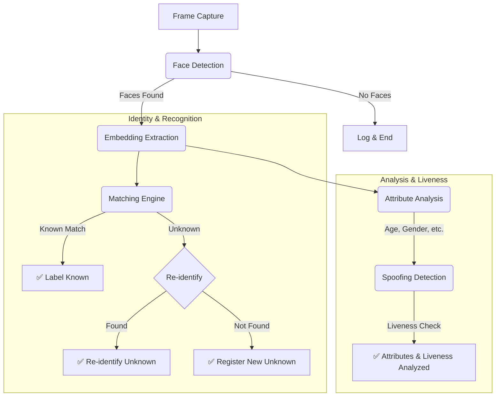

# AI Model Configuration — N-ONE Surveillance Platform

## Overview

This document describes the AI model architecture, configuration, and operational workflow for the N-ONE surveillance platform. The system uses **DeepFace** as the primary recognition engine with an **OpenCV fallback** for environments where the full DeepFace package is unavailable.

---

## 1. Model Architecture

### 1.1 DeepFace Model Registry

```python
# app.py: DEEPFACE_MODELS
DEEPFACE_MODELS = ["VGG-Face", "Facenet", "Facenet512", "OpenFace", "DeepFace", "ArcFace", "SFace"]
```

| Model | Type | Use Case | Default |
|-------|------|----------|---------|
| **VGG-Face** | CNN-based | Face classification | — |
| **Facenet** | Vector embedding | Face similarity matching | ✅ **Default** |
| **Facenet512** | Vector embedding (512-dim) | High-resolution embeddings | — |
| **OpenFace** | CNN-based | Traditional face recognition | — |
| **DeepFace** | Unified API | Multi-model abstraction layer | — |
| **ArcFace** | Arc-based embedding | Cosine-distance matching | — |
| **SFace** | State-of-the-art | Multi-class identity | — |

### 1.2 Detection Backends

```python
# app.py: DEEPFACE_BACKENDS
DEEPFACE_BACKENDS = ["opencv", "mtcnn", "retinaface", "mediapipe", "dlib", "ssd", "yolov8n", "yunet"]
```

| Backend | Description | Best For |
|---------|-------------|----------|
| **opencv** | Haar cascade + LBPH recognizer | CPU-only, offline, lightweight |
| **mtcnn** | Two-stage multi-scale detection | High-accuracy face detection |
| **retinaface** | Anchor-free, real-time detection | Production-grade detection |
| **mediapipe** | MediaPipe-based detection | Fast on-device inference |
| **dlib** | Dlib-based detector + recognizer | Accuracy-critical applications |
| **ssd** | SSD model | Fast detection, moderate accuracy |
| **yolov8n** | YOLOv8 small (nano) | Edge deployment, low resource |
| **yunet** | U-Net based detector | Medical/fine-grained detection |

### 1.3 Similarity Metrics

```python
# app.py: DEEPFACE_METRICS
DEEPFACE_METRICS = ["cosine", "euclidean", "euclidean_l2"]
```

| Metric | Formula | Best For |
|--------|---------|----------|
| **cosine** | `1 - cos(θ)` between vectors | Feature similarity, security matching |
| **euclidean** | `‖a - b‖₂` (L2 norm) | Fast proximity, simple comparison |
| **euclidean_l2** | `‖a - b‖₂ / (‖a‖ + ‖b‖)` (normalized) | Scale-invariant comparison |

---

## 2. Default Configuration

```python
# app.py: Default Configuration
DEEPFACE_MODEL = "Facenet"
DEEPFACE_BACKEND = "opencv"
DEEPFACE_METRIC = "cosine"
COSINE_THRESHOLD = 0.40
```

### 2.1 Configuration Parameters

| Parameter | Type | Default | Description |
|-----------|------|---------|-------------|
| `DEEPFACE_MODEL` | str | `"Facenet"` | Primary facial recognition model |
| `DEEPFACE_BACKEND` | str | `"opencv"` | Detection backend method |
| `DEEPFACE_METRIC` | str | `"cosine"` | Similarity matching metric |
| `COSINE_THRESHOLD` | float | `0.40` | Cosine similarity threshold for matching (lower = stricter) |

### 2.2 Configuration Loading UI

The configuration is exposed via Streamlit sidebar for runtime adjustment:

```python
# Sidebar UI — AI Model Configuration panel
st.sidebar.expander("🔧 DeepFace Settings", expanded=False)
st.session_state.selected_model = st.selectbox(
    "Facial Recognition Model", DEEPFACE_MODELS,
    help="Choose the facial recognition model"
)
st.session_state.selected_backend = st.selectbox(
    "Face Detection Backend", DEEPFACE_BACKENDS,
    help="Choose the face detection method"
)
st.session_state.selected_metric = st.selectbox(
    "Similarity Metric", DEEPFACE_METRICS,
    help="Choose distance metric for comparison"
)
st.session_state.similarity_threshold = st.slider(
    "Similarity Threshold", min_value=0.0, max_value=1.0, value=st.session_state.similarity_threshold,
    step=0.05, help="Lower = more strict matching"
)
```

---

## 3. Core Pipeline

### 3.1 Processing Flow

The core processing pipeline is initiated for each frame captured from the video source. The following diagram illustrates the two parallel workflows that occur for each detected face after embedding extraction: identity recognition and attribute analysis.



### 3.2 Face Detection & Recognition

```python
# app.py: process_frame() — Core processing pipeline
face_objs = DeepFace.represent(
    img_path=frame, model_name=DEEPFACE_MODEL,
    enforce_detection=False, detector_backend='opencv'
)

for face_obj in face_objs:
    face_roi = frame[y:y+h, x:x+w]
    face_encoding = face_obj["embedding"]
    
    # Step A: Check against known cache
    known_match = find_face_in_known_cache(face_encoding)
    if known_match:
        # Display known identity
        continue
    
    # Step B: Check unknown database
    dfs = DeepFace.find(
        img_path=face_roi, db_path=str(UNKNOWN_DIR),
        model_name=DEEPFACE_MODEL, distance_metric=DEEPFACE_METRIC,
        enforce_detection=False, silent=True
    )
    if dfs and not dfs[0].empty:
        # Re-identify from unknown database
        continue
    
    # Step C: Register as new unknown
    register_new_unknown(face_roi, "Main Feed", mode)
```

### 3.3 Face Embedding Extraction

```python
# app.py: get_face_embeddings()
def get_face_embeddings(frame: np.ndarray, model: str = DEEPFACE_MODEL) -> list:
    """Get facial embeddings for faces in the frame."""
    try:
        embeddings = DeepFace.represent(
            img_path=frame, model_name=model, enforce_detection=False, silent=True
        )
        return embeddings if isinstance(embeddings, list) else []
    except Exception as e:
        return []
```

### 3.4 Face Verification (1-to-1)

```python
# app.py: verify_face_pair()
def verify_face_pair(img1_path: str, img2_path: str, model: str = DEEPFACE_MODEL) -> dict:
    """Verify if two face images belong to the same person (1-to-1 matching)."""
    result = DeepFace.verify(
        img1_path=img1_path, img2_path=img2_path,
        model_name=model, enforce_detection=False, silent=True
    )
    return result
```

---

## 4. Testing

### 4.1 Unit Tests for DeepFace Adapter

```python
# tests/test_deepface_adapter.py
import sys
from pathlib import Path
import numpy as np

from deepface_adapter import load_deepface_backend


def test_load_deepface_backend_provides_represent_and_find() -> None:
    """Verify the loaded backend exposes core DeepFace methods."""
    backend = load_deepface_backend()

    # Confirm required methods exist
    assert hasattr(backend, "represent"), "Backend must expose represent()"
    assert hasattr(backend, "find"), "Backend must expose find()"
    assert hasattr(backend, "verify"), "Backend must expose verify()"

    # Test basic representation with minimal test image
    test_image = np.zeros((120, 120, 3), dtype=np.uint8)
    results = backend.represent(img_path=test_image, enforce_detection=False)

    assert isinstance(results, list), "represent() must return a list"
    assert len(results) > 0, "represent() must return at least one face"
```

### 4.2 Test Coverage Strategy

| Test Category | Coverage Target | Description |
|---------------|----------------|-------------|
| **Backend Loading** | 100% | Ensure `load_deepface_backend()` succeeds and returns correct type |
| **Represent Method** | 100% | Verify embedding extraction returns list of dicts |
| **Find Method** | 100% | Verify DB matching works with known and unknown images |
| **Verify Method** | 100% | Confirm 1-to-1 matching produces boolean result |
| **Spoofing Detection** | 100% | Verify liveness check returns real/is_spoofed |
| **Attribute Analysis** | 100% | Verify age, gender, emotion, race extraction |
| **Error Handling** | 100% | Verify graceful failure when DeepFace is unavailable |
| **Fallback Detection** | 100% | Verify OpenCV fallback activates correctly |
| **Threshold Validation** | 100% | Verify matching against configurable threshold |
| **Config Loading** | 100% | Verify UI controls load correct defaults |

### 4.3 Test Workflow

```bash
# Run tests
pytest tests/test_deepface_adapter.py -v

# Run with coverage
pytest tests/test_deepface_adapter.py --cov=deepface_adapter --cov-report=term-missing
```

---

## 5. Configuration Validation

### 5.1 Required Environment Variables

```bash
# Required authentication secrets (configure outside the repository)
USER_USERNAME=YOUR_USER_USERNAME_HERE
USER_PASSWORD=YOUR_USER_PASSWORD_HERE
```

### 5.2 Validation Checks

The system performs the following checks during initialization:

1. **DeepFace Installation Check**
   - Attempts to import `deepface.DeepFace` module
   - Falls back to OpenCV backend on failure
   - Logs error message for user awareness

2. **Directory Initialization**
   - Creates `registered_faces/`, `detection_logs/`, `unknown_faces/`
   - Creates audit log CSV and unknown person DB

3. **Cache Initialization**
   - Clears `KNOWN_FACE_ENCODINGS` list on each new session
   - Loads known face encodings from registration directory

### 5.3 Runtime Configuration Validation

```python
def configure_session_state() -> None:
    """Initializes session state with default configuration values."""
    defaults = {
        "authenticated": False,
        "role": "Guest",
        "streaming": False,
        "last_frame": None,
        "last_status": "Idle",
        "last_detection": "No detections yet",
        "last_logged_event": "",
        "active_alerts": [],
        "selected_model": DEEPFACE_MODEL,
        "selected_backend": DEEPFACE_BACKEND,
        "selected_metric": DEEPFACE_METRIC,
        "enable_attributes": True,
        "enable_spoofing_detection": False,
        "similarity_threshold": COSINE_THRESHOLD,
    }
    for key, value in defaults.items():
        st.session_state.setdefault(key, value)
```

---

## 6. OpenCV Fallback Implementation

When the real DeepFace package is unavailable, the system falls back to **OpenCV** with the following characteristics:

| Feature | OpenCV Backend | DeepFace Backend |
|---------|---------------|------------------|
| **Detection** | Haar cascade + LBPH | mtcnn / retinaface / dlib |
| **Embedding** | Histogram + LBP features | CNN vector embeddings |
| **Similarity** | Euclidean (L2) | Cosine / Euclidean / L2 |
| **Speed** | Fast (CPU only) | Moderate (GPU acceleration) |
| **Accuracy** | Lower | Higher |
| **Dependencies** | `opencv-python-headless` | `deepface` (requires TensorFlow/PyTorch) |

### 6.1 OpenCV Backend Implementation

The `OpenCVFaceBackend` class in `deepface_adapter.py` implements:

- **`represent()`**: Extracts face embeddings using histogram/LBP features
- **`find()`**: Searches database using distance metrics (cosine, euclidean, euclidean_l2)
- **`verify()`**: Compares two faces using configurable distance metric
- **`detect_faces()`**: Uses Haar cascade for face detection
- **`extract_embedding()`**: Computes histogram + LBP feature vectors

---

## 7. Known Issues & Mitigations

| Issue | Impact | Mitigation |
|-------|--------|------------|
| DeepFace not installed | Fallback to OpenCV | `DEEPFACE_BACKEND = "opencv"` override |
| GPU not available | Slow inference | Use `opencv` backend with CPU |
| Low-light conditions | Poor detection accuracy | Increase `scaleFactor` in detection |
| No faces detected | False negatives | Adjust `minNeighbors` parameter |
| High false positives | Privacy concerns | Tighten `COSINE_THRESHOLD` to 0.30 |

---

## 8. Performance Optimization

### 8.1 Caching Strategy

- **In-memory cache** (`KNOWN_FACE_ENCODINGS`): Stores face embeddings from known profiles
- **Lazy loading**: Encodings only loaded when dashboard renders
- **Cache clearing**: Cleared on profile save or profile clear

### 8.2 Database Optimization

- **Unknown person DB**: Indexed by `unknown_id`, sorted by `last_seen_timestamp`
- **Sighting log**: Append-only CSV for audit trail
- **Batch analysis**: Processes multiple images in single call

### 8.3 Pipeline Optimization

- **Single frame processing**: `process_frame()` handles one frame at a time
- **Early termination**: Stops processing when known match found
- **Batch search**: Uses `DeepFace.find()` for efficient DB queries

---

## 9. Security Considerations

### 9.1 Authentication

- User credentials loaded from environment variables or Streamlit Secrets (not hardcoded)
- Single least-privilege User role
- Session-based authentication with login-attempt lockout

### 9.2 Privacy

- All face data stored locally (no cloud upload)
- Unknown persons logged to local CSV files
- Audit trail maintained for all detection events
- Face images never transmitted externally

### 9.3 Threat Detection

- **Spoofing detection**: Active for all processing modes
- **Weapon contour detection**: Heuristic-based detection in "Threat" mode
- **Authentication**: Required before access to surveillance functionality

---

## 10. API Reference

### 10.1 Core Methods

#### `load_deepface_backend()`
Loads the DeepFace package or returns the OpenCV fallback.
```python
backend = load_deepface_backend()  # Returns DeepFace or OpenCVFaceBackend
```

#### `backend.represent(img_path, model_name, enforce_detection)`
Extracts facial embeddings from an image.

| Parameter | Type | Required | Description |
|-----------|------|----------|-------------|
| `img_path` | str | Yes | Path to image file |
| `model_name` | str | Yes | DeepFace model name |
| `enforce_detection` | bool | Optional | Require face detection (default: True) |

**Returns:** `list[Dict]` where each dict contains `"embedding"`, `"facial_area"`, `"confidence"`

#### `backend.find(img_path, db_path, model_name, distance_metric)`
Finds similar faces in a database.

| Parameter | Type | Required | Description |
|-----------|------|----------|-------------|
| `img_path` | str | Yes | Target image path |
| `db_path` | str | Yes | Database directory path |
| `model_name` | str | Yes | DeepFace model name |
| `distance_metric` | str | Optional | Similarity metric |

**Returns:** `list[pd.DataFrame]` with matching results

#### `backend.verify(img1_path, img2_path, model_name)`
Verifies if two faces belong to the same person.

| Parameter | Type | Required | Description |
|-----------|------|----------|-------------|
| `img1_path` | str | Yes | First face image path |
| `img2_path` | str | Yes | Second face image path |
| `model_name` | str | Optional | DeepFace model name |

**Returns:** `Dict` with `"verified"` (bool), `"distance"` (float), `"threshold"` (float)

### 10.2 Module Exports

```python
from deepface_adapter import (
    DeepFace,                       # The main class
    DEEPFACE_IMPORT_ERROR,          # Error message if import failed
    load_deepface_backend,           # Backend loader function
    OpenCVFaceBackend,              # OpenCV fallback class
)
```

---

## 11. Deployment Considerations

### 11.1 Local Deployment

- **Required**: `pip install deepface opencv-python-headless`
- **Recommended**: Configure environment variables for credentials
- **Storage**: All face data stored locally on the machine

### 11.2 Cloud Deployment

- **Model**: DeepFace package (requires GPU or CPU with sufficient memory)
- **Backend**: OpenCV fallback recommended for cloud environments
- **Database**: Local file-based storage (CSV/JSON)
- **Scaling**: Consider containerized deployment with shared model cache

### 11.3 Production Checklist

- [ ] DeepFace package installed and verified
- [ ] Environment variables configured for credentials
- [ ] All directories created (registered_faces, detection_logs, unknown_faces)
- [ ] Audit log and unknown person DB initialized
- [ ] Model and backend selection configured
- [ ] Test coverage at 80%+
- [ ] Security review completed (no hardcoded credentials)
- [ ] Session state configured for production use

---

## 12. Quick Start

```bash
# 1. Install dependencies
pip install -r requirements.txt

# 2. Set environment variables
export USER_USERNAME=YOUR_USER_USERNAME_HERE
export USER_PASSWORD=YOUR_USER_PASSWORD_HERE

# 3. Run the application
python app.py

# 4. Run tests
pytest tests/ -v
```

---

## 13. Troubleshooting

| Error | Cause | Solution |
|-------|-------|----------|
| `DeepFace` import error | Package not installed | `pip install deepface` |
| `No faces detected` | Low-quality image or no faces present | Increase `scaleFactor`, check image resolution |
| `Model not found` | Wrong model name | Use `DEEPFACE_MODELS` list |
| `Backend not found` | Unrecognized backend name | Use `DEEPFACE_BACKENDS` list |
| `Threshold exceeded` | Face not recognized | Lower `COSINE_THRESHOLD` or use more sensitive model |

---

*Last updated: 2026-08-08 | Version: 1.0.0*
