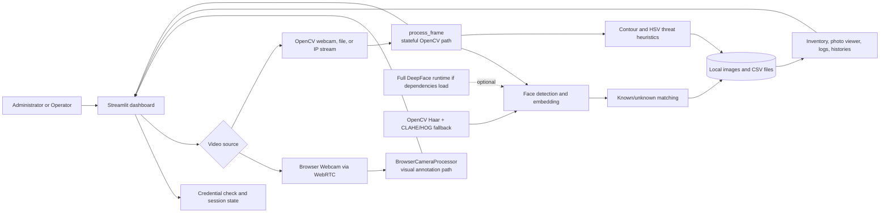
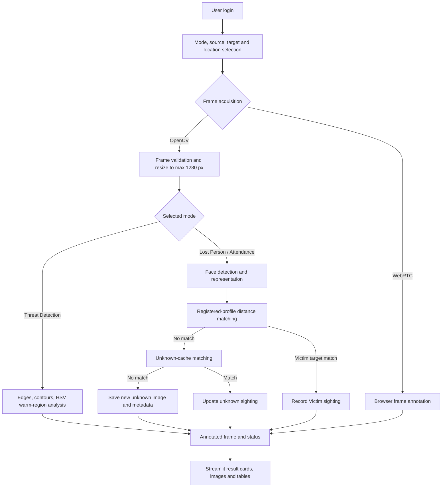
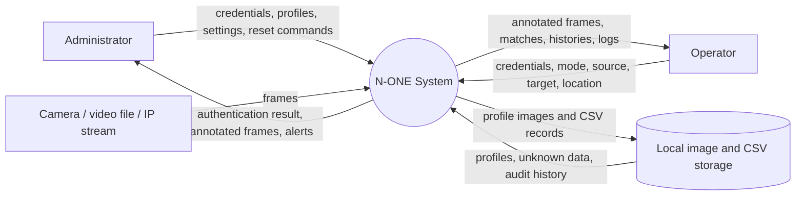
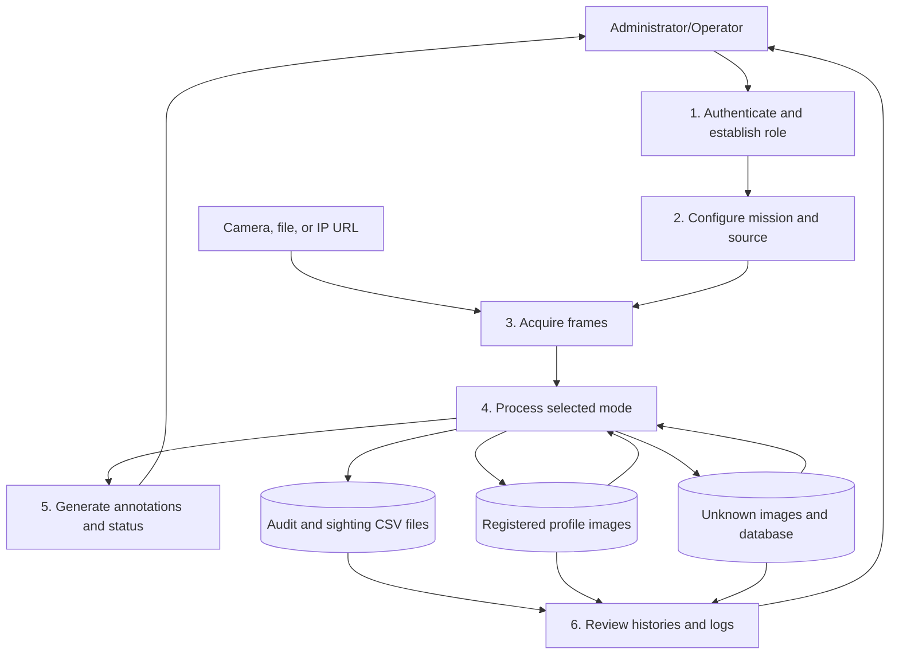
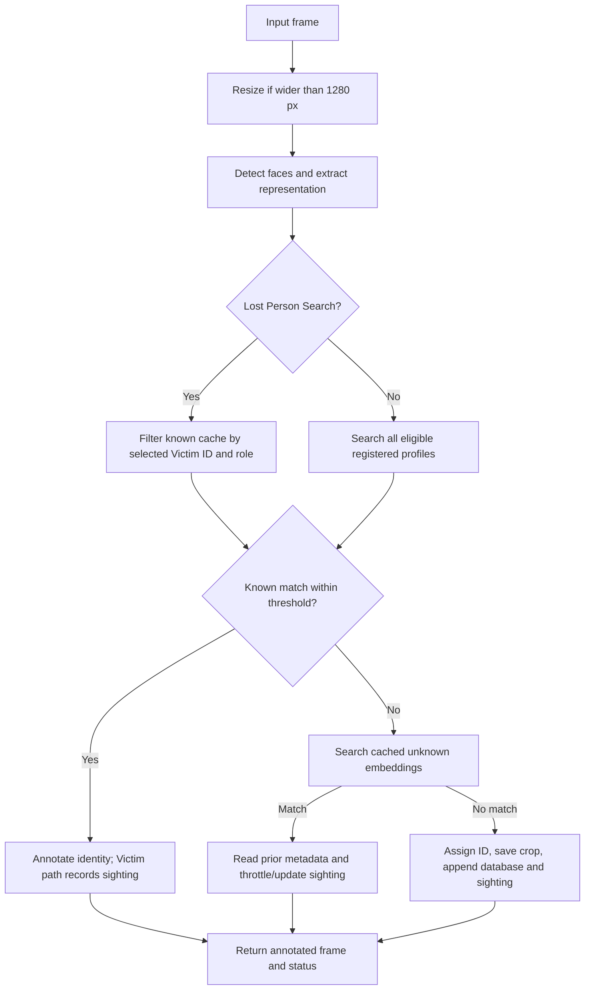
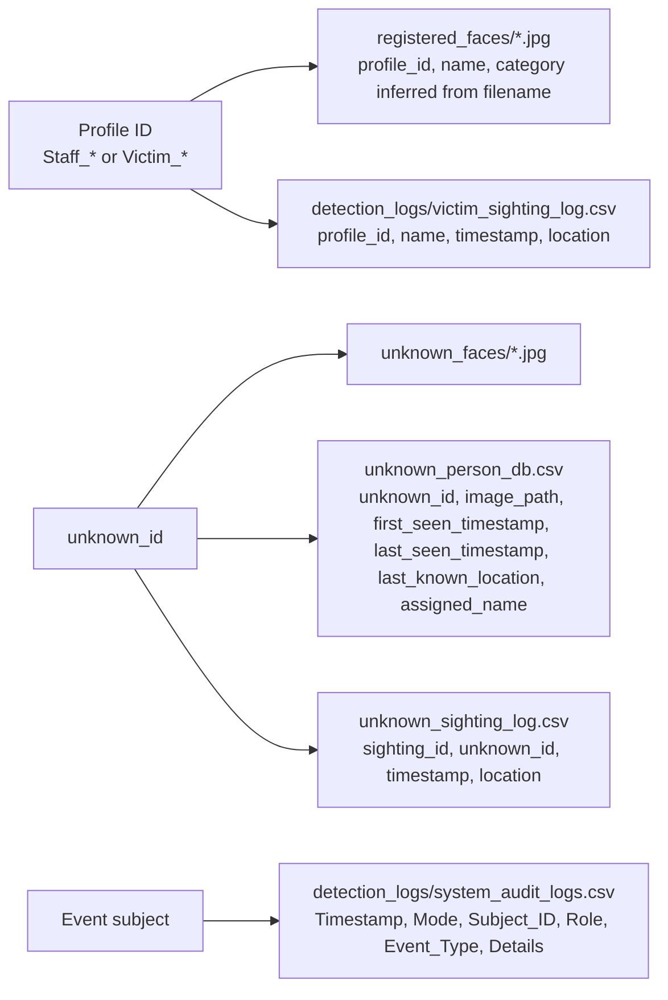

# N-ONE: Complete Project Report

## Project Title

**N-ONE (No One Escapes): Local AI Surveillance, Lost-Person Search and Threat-Monitoring Dashboard**

**Audit date:** 13 August 2026
**Repository:** `D:\n-0ne`
**Source of truth:** The implementation in `app.py`, `deepface_adapter.py`, the test suite, configuration files, and runtime data directories.

> **Scope note.** This report describes the current repository, not the full feature list proposed in older documentation. The observed runtime loads `OpenCVFaceBackend` because TensorFlow is unavailable. DeepFace neural-model features are therefore conditional and were not treated as active runtime capabilities.

---

## Abstract

N-ONE is a Python and Streamlit surveillance dashboard for three operational modes: Lost Person Search, Member Attendance Logger, and Threat Detection Mode. It accepts browser-camera input through WebRTC, server-side webcam input, recorded video files, and IP camera URLs. For face-recognition modes, the application detects faces, represents them as feature vectors, compares them with registered profiles, and maintains a local store of unknown face images and sightings. In threat mode it uses OpenCV contour and warm-colour heuristics to flag possible weapons or fire-like regions.

The application uses a Streamlit user interface, OpenCV for image/video processing, pandas for CSV persistence, Pillow for image loading, SciPy for distance calculations, and a DeepFace-compatible adapter. When the full DeepFace/TensorFlow runtime is unavailable, the adapter falls back to OpenCV Haar frontal/profile detection and a CLAHE-normalized HOG descriptor. Authentication supports Administrator and Operator roles using environment variables or Streamlit Secrets, constant-time credential comparison, and a temporary failed-login lockout.

The implementation is a local, single-application prototype. It has no separate HTTP backend, REST API, relational database, password-hashing service, encrypted storage layer, or demonstrated production accuracy/performance benchmark. Six repository tests passed during this audit, and both primary Python files passed compilation.

---

## 1. Introduction

### 1.1 Background

Security teams often receive video from several sources and must decide whether a visible person is a registered subject, a previously observed unknown person, or a possible threat. Manual review is slow, repetitive, and difficult to audit. A practical prototype can assist an operator by combining video acquisition, face comparison, unknown-person tracking, event logging, and a review dashboard.

### 1.2 Project context

N-ONE addresses this problem with a browser-based Streamlit console. The application stores registered face crops under `registered_faces/`, captured unknown face crops under `unknown_faces/`, and event/history records in CSV files under the project root and `detection_logs/`. The system is designed for local or controlled deployment rather than a distributed surveillance platform.

### 1.3 Proposed solution

The implemented solution is a single Python application with these stages:

1. Authenticate an Administrator or Operator.
2. Select a surveillance mode and video source.
3. Optionally select a Victim target and enter a camera location.
4. Capture frames through WebRTC or OpenCV.
5. Detect faces or run threat heuristics.
6. Compare face embeddings with registered and previously unknown faces.
7. Annotate the frame and update the appropriate local records where the OpenCV processing path is used.
8. Display the latest status, inventory, photo metadata, and logs.

### 1.4 Important implementation boundary

The repository contains a vendored `deepface/` package and exposes DeepFace model/backend selectors, but the observed runtime error is `No module named 'tensorflow'`. Consequently, the active backend during this audit is `OpenCVFaceBackend`. The selectable neural model names do not activate neural models in this state.

---

## 2. Objective of the Project

### 2.1 Primary objective

To provide an operator-facing dashboard that assists with face-based surveillance, lost-person search, attendance-style recognition, unknown-person re-identification, and heuristic threat monitoring.

### 2.2 Secondary objectives

1. Provide a role-gated interface for Administrators and Operators.
2. Allow an Administrator to register Staff and Victim profiles from an upload or guided five-angle capture.
3. Save face-only crops rather than the complete registration image.
4. Support multiple video sources appropriate to local and browser-based use.
5. Restrict Lost Person Search to one selected Victim profile.
6. Preserve unknown-person image and sighting history in local CSV/image storage.
7. Provide a review interface for registered profiles, unknown profiles, audit events, and Victim location history.
8. Provide a reusable adapter interface so a full DeepFace runtime can be used when its dependencies are installed.

### 2.3 Technical objectives

- Use OpenCV for frame capture, face-region processing, annotations, and contour heuristics.
- Use embedding-distance comparison with cosine, Euclidean, or normalized Euclidean distance.
- Keep registered encodings in an in-memory cache and unknown encodings in a cache to avoid scanning the unknown directory on every OpenCV frame.
- Keep UI state in Streamlit session state.
- Persist operational records using pandas CSV reads/writes.

### 2.4 Security objectives

- Fail closed when required credentials are missing.
- Separate Administrator-only controls from the common monitoring interface.
- Compare credentials with `hmac.compare_digest`.
- Lock login attempts for 60 seconds after five failed attempts in the current session.
- Avoid printing or documenting secret values.

These objectives are implemented only within the limitations described in Section 18. Password hashing, encrypted storage, and a dedicated identity provider are **not implemented in the current version**.

---

## 3. Scope of the Project

### 3.1 Current scope

The current implementation supports:

- Administrator and Operator login.
- Administrator-only profile registration, model-setting changes, profile deletion, and audit reset.
- Staff and Victim profile categories, including legacy `Member_` and `Lost_` prefixes.
- Single-image registration and guided five-angle registration.
- Face-only crop validation requiring exactly one face and a minimum face size.
- Lost Person Search for one selected Victim.
- Member Attendance Logger against the registered profile cache.
- Threat Detection Mode based on contour shape and warm-colour regions.
- Browser Webcam (WebRTC), Laptop Webcam, Recorded Video File, and IP Camera Stream inputs.
- Registered/unknown inventory counters and photo viewers.
- 1-to-1 face comparison and batch attribute-analysis UI hooks.
- CSV audit, unknown-person, unknown-sighting, and Victim-sighting views.

### 3.2 User scope

- **Administrator:** all monitoring features plus profile registration, AI setting controls, profile clearing, and audit reset.
- **Operator:** monitoring, Victim selection, camera source/location selection, inventory/photo review, analytics UI, and log review.
- **Guest:** authentication screen only.

There is no implemented third end-user role. The `USER_*` values found in the local ignored secrets file are not consumed by `app.py`.

### 3.3 Technical scope

The system is a monolithic Streamlit application. There is no separate controller/service process, API gateway, ORM, message queue, or relational database. The project includes a vendored DeepFace source tree, but the application-facing integration is through `deepface_adapter.py`.

### 3.4 Security scope

Implemented security-related controls are credential loading from environment/Streamlit Secrets, fail-closed startup of authentication, constant-time comparison, temporary login lockout, logout, and UI role gating. There is no evidence of password hashing, encryption at rest, TLS configuration, JWT, server-side session database, audit logging of every login/logout, or fine-grained per-record authorization.

### 3.5 AI/ML scope

The active audited fallback is not a trained neural face-recognition model. It uses Haar cascades for frontal/profile detection and HOG features after resizing and CLAHE normalization. The full DeepFace route, including selectable model names and detector backends, is available only when its runtime dependencies load successfully.

### 3.6 Future scope

Cloud deployment, a relational/event database, distributed camera management, trained weapon detection, production liveness detection, password hashing/identity federation, automated UI testing, model calibration, and performance benchmarking are future improvements, not current functionality.

---

## 4. Definition of the Problem

### 4.1 Existing problem

An operator may need to search a video stream for one missing person, distinguish registered personnel from unrecognized people, and preserve enough history to review repeated sightings. When this is done manually, the operator must watch the feed, remember identities, record timestamps, and maintain separate evidence files.

### 4.2 Technical challenges

- Video sources have different access models: browser cameras are client-side, while local webcams and IP/video files are opened by the server process.
- Face crops vary in illumination, pose, scale, and background.
- A full frame may contain multiple faces and each face must be matched independently.
- Repeated video frames can create duplicate event records unless writes are throttled.
- Unknown images and CSV records can become inconsistent after files are moved or restored.
- The complete DeepFace runtime has heavyweight dependencies that are not present in the audited environment.

### 4.3 Security and operational challenges

The application processes biometric-like face images and camera-location history on local storage. A practical deployment therefore needs stronger secret handling, access logging, encryption, retention controls, and privacy governance than the current prototype provides. Operators also need to understand that a heuristic contour alert is a possible-threat indicator, not a verified weapon classifier.

### 4.4 Problem-solving approach

N-ONE reduces manual work by combining source selection, per-face processing, selected-target filtering, local unknown re-identification, annotation, and structured review screens in a single dashboard. It is an operational assistance tool; it does not establish identity or threat status with a guaranteed level of accuracy.

---

## 5. Benefits of the Project

The implementation can provide the following practical benefits when used within its limitations:

- **Reduced manual review:** face matching and frame annotation are automated.
- **Targeted search:** Lost Person Search restricts visible known matches to one selected Victim.
- **Repeat-unknown context:** previously saved unknown IDs can be associated with earlier timestamps and locations on the OpenCV processing path.
- **Centralized review:** profile inventory, photo metadata, unknown records, and logs are shown in one UI.
- **Multi-source operation:** the dashboard supports browser, local, file, and IP inputs.
- **Evidence organization:** profile images and CSV histories have predictable paths and headers.
- **Maintainability:** the fallback adapter presents DeepFace-like `represent`, `find`, and `verify` methods, allowing the application code to use one interface.
- **Resource awareness:** frame width is capped at 1280 pixels before processing, and cache structures reduce repeated disk scans.

Accuracy, real-time frame rate, and detection recall have not been measured in the repository. Those benefits must therefore be validated with a controlled dataset before being claimed quantitatively.

---

## 6. Literature Review

### 6.1 Face detection and representation

The classical face-processing pipeline commonly separates detection, alignment, representation, and comparison. DeepFace formalized a high-accuracy deep-learning pipeline using alignment and learned representations [1]. FaceNet later described learning a compact embedding space in which distances can support verification, recognition, and clustering [2]. N-ONE follows the same broad conceptual pattern—detect a face, derive a representation, and threshold a distance—but its observed fallback representation is a HOG descriptor, not a FaceNet embedding.

The fallback detector uses OpenCV Haar cascades. The cascade approach is computationally lightweight and suitable for a CPU prototype, but it can be sensitive to pose, lighting, scale, occlusion, and camera quality. OpenCV documents cascade-based multi-scale detection as an object-detection mechanism rather than a biometric identity guarantee [3].

### 6.2 Framework and real-time media

Streamlit provides the application UI and reactive execution model [4]. The project uses `streamlit-webrtc` for browser-side camera access; the component’s documented usage relies on a unique stream key, browser media permissions, and a frame processor [5]. The OpenCV video path is separate and is appropriate when the camera or stream is reachable by the host process.

### 6.3 Relevance to N-ONE

The literature supports the architectural idea of comparing face representations with a distance threshold, but it does not validate N-ONE’s current fallback accuracy. The code does not train a model, publish a benchmark, or establish a calibrated threshold for a particular population. The threshold values in code are operational defaults and should be evaluated with genuine/impostor pairs before deployment.

### 6.4 Difference from existing research systems

The referenced research systems focus on learned representation quality and benchmark evaluation. N-ONE focuses on an end-to-end operator workflow: authentication, source selection, selected Victim search, local image/CSV persistence, and review screens. Its current contribution is integration and workflow prototyping, not a new recognition algorithm.

---

## 7. Main Modules

### 7.1 Authentication and RBAC module

**Purpose:** Gate the dashboard and distinguish Administrator from Operator.
**Input:** Username and password entered in the Streamlit sidebar.
**Processing:** Load four required secret names from environment variables or Streamlit Secrets; compare values with `hmac.compare_digest`; set Streamlit session state; lock after five failed attempts for 60 seconds.
**Output:** Authenticated role or an error/lockout message.
**Important files:** `app.py`, `.env.example`, `.streamlit/secrets.toml` (ignored; values not reproduced).
**Dependencies:** `hmac`, `os`, Streamlit session state.
**Interaction:** Controls access to all other modules.

### 7.2 Profile registration module

**Purpose:** Create Staff or Victim face profiles.
**Input:** Uploaded image or five camera captures (`front`, `left`, `right`, `up`, `down`) plus a name and classification.
**Processing:** Decode image, detect faces, require exactly one face, reject faces smaller than 80×80 pixels, add 25% padding, save only the crop, and refresh the known-face cache.
**Output:** `Staff_<name>__<angle>.jpg` or `Victim_<name>__<angle>.jpg`.
**Important files:** `app.py`, `registered_faces/`.
**Dependencies:** Pillow, OpenCV, active face backend.
**Interaction:** Feeds the registered inventory and known-face matcher.

### 7.3 Video ingestion module

**Purpose:** Acquire frames.
**Input:** Browser webcam, host webcam index, uploaded MP4/AVI/MOV, or RTSP/HTTP URL.
**Processing:** WebRTC uses `BrowserCameraProcessor`; other sources use `cv2.VideoCapture`. Local cameras are probed through DirectShow, Media Foundation, and default OpenCV backends across indices 0–2.
**Output:** BGR frames for processing and annotated frames for the UI.
**Important files:** `app.py`.
**Dependencies:** OpenCV and optional `streamlit-webrtc`/PyAV.
**Interaction:** Sends frames to either `process_frame` or `annotate_browser_frame`.

### 7.4 Face recognition and matching module

**Purpose:** Compare detected faces with registered and previously unknown face encodings.
**Input:** A frame, mode, selected Victim ID, model/backend/metric settings, threshold, and location.
**Processing:** Detect and represent each face; compare with the known cache; optionally restrict matching to one Victim; compare unmatched faces with the unknown cache; create or update unknown records.
**Output:** Match status, distance, annotations, and local records on the OpenCV path.
**Important files:** `app.py`, `deepface_adapter.py`, `registered_faces/`, `unknown_faces/`.
**Dependencies:** DeepFace when available; otherwise OpenCV, NumPy, SciPy, pandas.
**Interaction:** Used by Lost Person Search and Member Attendance Logger.

### 7.5 Unknown-person tracking module

**Purpose:** Assign stable local IDs to faces not matching registered profiles.
**Input:** Face crop, embedding, camera location, and active mode.
**Processing:** Assign the next sequential ID, save a JPEG, append to `unknown_person_db.csv`, append sighting history, cache the embedding, and throttle repeat writes to two seconds per ID/location pair.
**Output:** Unknown ID, first/last-seen metadata, location history, and review image.
**Important files:** `app.py`, `unknown_person_db.csv`, `unknown_sighting_log.csv`, `unknown_faces/`.
**Interaction:** Runs after known matching fails in the OpenCV processing path.

### 7.6 Victim search module

**Purpose:** Search for one selected Victim.
**Input:** Victim profile selector, camera source, camera location, and frames.
**Processing:** Known-cache comparison is filtered by the selected profile ID and role `Victim`; a match is recorded with 60-second duplicate suppression per location and shown in a dedicated result card.
**Output:** Victim name, profile ID, distance, timestamp, location, saved image, and location history.
**Important files:** `app.py`, `detection_logs/victim_sighting_log.csv`.
**Interaction:** Uses face recognition and storage; non-target faces are hidden in the display.

### 7.7 Threat detection module

**Purpose:** Flag possible weapon-like elongated contours and fire-like warm regions.
**Input:** Video frame.
**Processing:** Grayscale blur, Canny edges, morphological close, contour area/aspect/fill/solidity filters, and HSV warm-colour segmentation.
**Output:** Annotated boxes labeled `Possible weapon` or `Possible fire`, plus a throttled audit event.
**Important files:** `app.py`, `detection_logs/system_audit_logs.csv`.
**Dependencies:** OpenCV.
**Interaction:** Exclusive processing branch; face recognition is skipped in Threat Detection Mode.

### 7.8 Dashboard and review module

**Purpose:** Present controls and outputs.
**Input:** Session state, local image files, and CSV files.
**Processing:** Render metrics, selectors, tables, photos, result cards, analytics tabs, and logs.
**Output:** Streamlit dashboard.
**Important files:** `app.py`, `assets/n_one_logo.png`.
**Interaction:** Reads all storage modules and starts processing.

### 7.9 Conditional analytics module

The code exposes face verification, batch facial attribute analysis, face extraction, embeddings, and anti-spoofing wrappers. These are UI/API hooks, not evidence that all capabilities are active. In the audited fallback, `OpenCVFaceBackend` implements `represent`, `find`, and `verify`, but does not implement the full DeepFace `analyze`, `extract_faces`, or `detect_spoofing` surface. Facial attributes and anti-spoofing are therefore **not implemented in the active fallback runtime**.

---

## 8. System Architecture

N-ONE uses a monolithic three-part architecture:

1. **Presentation layer:** Streamlit widgets, result cards, tables, and image display.
2. **Processing layer:** WebRTC/OpenCV frame acquisition, face representation, distance matching, unknown tracking, and threat heuristics.
3. **Local storage layer:** JPEG/PNG image directories and CSV files.

There is no independent backend API. Function calls inside `app.py` are the application’s controller/business-logic boundary.

**Figure 1: Overall System Architecture**



The dashed branch is conditional. The WebRTC branch is intentionally lightweight: `annotate_browser_frame` avoids Streamlit session-state writes, CSV writes, and disk writes from its worker thread. Therefore, its current implementation is not equivalent to the fully stateful `process_frame` path.

---

## 9. Technical Overview

### 9.1 Frontend architecture

Streamlit renders a wide dark-themed page with a sidebar security gate. After authentication, the main page contains mode/source selectors, camera-location input, metrics, surveillance controls, a live frame/result area, registered inventory, photo viewer, facial analytics tabs, and log tables. Streamlit session state holds authentication, role, selected settings, selected Victim, streaming state, and the latest result.

### 9.2 Backend/application architecture

All application logic is in `app.py`. Functions act as storage helpers, matching services, processing routines, rendering functions, and initialization routines. This keeps the prototype simple but also creates a large single module with shared globals and direct file I/O.

### 9.3 Face-processing architecture

`deepface_adapter.py` first attempts to import `deepface.DeepFace` from the vendored package. On any import failure it instantiates `OpenCVFaceBackend`. The fallback detects frontal and profile faces with Haar cascades, deduplicates overlapping boxes, resizes each face crop to 64×64, applies CLAHE, computes a HOG vector, and normalizes it. The application compares vectors using the selected metric.

### 9.4 Video-source architecture

- **Browser Webcam:** WebRTC sends browser frames to a worker processor and returns annotated video.
- **Laptop Webcam:** OpenCV probes host camera indices and Windows backends.
- **Recorded Video File:** Uploaded bytes are written to `temp_video_upload.mp4` and opened by OpenCV.
- **IP Camera Stream:** A user-entered RTSP/HTTP URL is passed to OpenCV.

### 9.5 Data/storage architecture

The persistence model is file based:

| Store | Actual location | Purpose |
|---|---|---|
| Registered profiles | `registered_faces/*.jpg` | Face-only Staff/Victim crops; multi-angle files share a profile ID. |
| Unknown images | `unknown_faces/*.jpg` | Captured unknown face crops. |
| Main audit log | `detection_logs/system_audit_logs.csv` | Timestamp, mode, subject, role, event type, details. |
| Unknown database | `unknown_person_db.csv` | One logical row per unknown ID with image path and first/last-seen metadata. |
| Unknown sightings | `unknown_sighting_log.csv` | Sighting ID, unknown ID, timestamp, location. |
| Victim sightings | `detection_logs/victim_sighting_log.csv` | Victim profile ID, name, timestamp, location. |

### 9.6 API architecture

There are no HTTP routes or application API endpoints implemented by N-ONE. The only networked media behavior is the WebRTC component and any IP camera URL opened by OpenCV. The vendored DeepFace API is a library interface, not an N-ONE REST API.

### 9.7 Authentication and authorization architecture

Credentials are read from process environment or Streamlit Secrets. A complete credential set is required. The Administrator role unlocks registration, AI settings, clearing profiles, and audit reset. Both authenticated roles can view the dashboard inventory and logs. Authorization is implemented in Streamlit rendering logic; there is no separate authorization middleware or database policy layer.

### 9.8 Security architecture

Implemented controls are limited to secret-based login, `hmac.compare_digest`, lockout, logout, and role-conditioned controls. The local CSV/image files are not encrypted by N-ONE. The `.env.example` contains placeholders, while local ignored secret configuration is intentionally not reproduced in this report.

---

## 10. Hardware Requirements

The following are reasonable operational configurations derived from the CPU-capable implementation. They are not measured performance guarantees.

**Table 1: Hardware Requirements**

| Component | Minimum configuration | Recommended configuration |
|---|---|---|
| Processor | Modern 64-bit CPU with at least 4 cores | 6–8 core CPU; GPU optional for a future full DeepFace runtime |
| Memory | 8 GB RAM | 16 GB RAM for video, caches, and optional neural dependencies |
| Storage | 5 GB for software plus space for image/CSV growth | SSD with capacity sized for retention policy and camera workload |
| Camera | One browser or host webcam for live use | 720p/1080p camera with stable lighting; multiple cameras require separate source handling or future orchestration |
| Network | Local network for IP streams and browser access | Stable low-latency network for RTSP/WebRTC operation |
| GPU | Not required for the active OpenCV fallback | Useful but not required for a verified TensorFlow/DeepFace configuration |

The project does not calculate a retention size, maximum camera count, or required FPS. Those values are **not implemented or benchmarked in the current version**.

---

## 11. Software Requirements

**Table 2: Software Requirements**

| Software/component | Declared or observed value | Role |
|---|---|---|
| Python | Documentation requires 3.10+; observed interpreter was Python 3.14 | Runtime |
| Streamlit | `1.60.0` in `requirements.txt`; observed 1.60.0 | UI |
| DeepFace | `0.0.100` in `requirements.txt` | Optional/full face-analysis integration; fallback used in audit |
| OpenCV | `opencv-python-headless==4.13.0.92` declared; observed `cv2` reported 5.0.0 | Video, detection, annotation, heuristics |
| NumPy | `2.4.4` | Arrays and numerical processing |
| pandas | `3.0.3` | CSV persistence and tables |
| Pillow | `12.2.0` | Image decoding and temporary image conversion |
| SciPy | Unpinned in requirements; observed 1.18.0 | Cosine distance |
| streamlit-webrtc | `0.77.0` | Browser camera path |
| PyAV | Imported as `av`; supplied by the WebRTC dependency path | Video frame conversion |
| Linux packages | `libgl1`, `libgl1-mesa-glx`, `libsm6`, `libxext6`, `libglib2.0-dev` | Container/OpenCV support |
| Browser | Modern browser with camera permission support | Streamlit and WebRTC UI |

Version conflicts between declared and observed OpenCV/Python environments should be resolved before reproducible deployment. TensorFlow is not listed as a direct requirement and was unavailable during the audit; the full neural DeepFace path therefore did not load.

---

## 12. Block Diagram

**Figure 2: System Block Diagram**



---

## 13. Data Flow Diagram (DFD)

### 13.1 Level 0 / Context Diagram

**Figure 3: Context-Level DFD**



### 13.2 Level 1 DFD

**Figure 4: Level-1 DFD**



### 13.3 Level 2 DFD: Face-processing path

**Figure 5: Level-2 Face-Processing DFD**



### 13.4 DFD boundary note

The WebRTC worker uses a separate `annotate_browser_frame` path. It performs visual matching/annotation but intentionally avoids disk and Streamlit state writes. Therefore, the persistence flows in Level 2 apply to `process_frame` (OpenCV webcam/file/IP processing) and not fully to the current browser worker.

---

## 14. Entity Relationship Diagram / Actual Data Model

N-ONE does not use a relational database, ORM, SQL schema, or foreign-key constraints. A conventional ER diagram is therefore **not applicable to the current implementation**. The application uses image files plus denormalized CSV records.

**Figure 6: Actual File-Based Data Architecture**



### 14.1 Keys and relationships

- `profile_id` is inferred from a filename prefix and is shared across angle files using `__angle` suffixes.
- `unknown_id` is the logical key for unknown-person rows and image filenames.
- `sighting_id` is intended to identify an unknown sighting record, although existing CSV data contains blank values in the inspected sample; there is no database constraint enforcing uniqueness.
- CSV relationships are application-level lookups, not foreign keys.
- Cardinality is therefore informal: one profile can have multiple angle images and Victim sightings; one unknown can have one current database row, one image, and many sightings.

---

## 15. Output Screens

No screenshots of a running N-ONE dashboard were found in the project. The logo asset is available, but it is not a screenshot. **Screenshot required from the running application** for university submission.

### 15.1 Authentication screen/sidebar

**Purpose:** Authenticate the operator.
**User role:** Guest before login.
**Input:** Username and password.
**Output:** Login success, invalid-credential message, or lockout message.
**Backend connection:** `load_auth_credentials`; no remote API.

### 15.2 Administrator controls

**Purpose:** Register profiles, configure face settings, clear registered profiles, and reset audit logs.
**User role:** Administrator only.
**Input:** Upload/camera captures, name, Staff/Victim category, model/backend/metric/threshold controls.
**Output:** Saved face-only crops and updated caches.
**Backend connection:** Direct calls to local functions and filesystem.

### 15.3 Operational console

**Purpose:** Start and stop surveillance.
**User role:** Authenticated Administrator or Operator.
**Input:** Mode, video source, optional file/URL, camera location, Victim target.
**Output:** Live annotated frames and status.
**Backend connection:** WebRTC worker or OpenCV `VideoCapture`.

### 15.4 Registered face inventory

**Purpose:** Show counts and a table of registered profiles.
**User role:** Authenticated roles.
**Input:** `All`, `Staff`, or `Victim` filter.
**Output:** Name, category, and profile filename.
**Backend connection:** `get_registered_profiles_df`.

### 15.5 Face photo viewer

**Purpose:** View one Registered, Victim, or Unknown image with metadata.
**User role:** Authenticated roles.
**Input:** Photo category and selected profile ID.
**Output:** Stored image, angle images, profile/unknown metadata.
**Backend connection:** Local image directories and CSV files.

### 15.6 Victim Found card

**Purpose:** Emphasize a selected Victim match.
**User role:** Authenticated roles running Lost Person Search.
**Input:** Matching frame and selected Victim.
**Output:** Image, profile ID, location, distance, timestamp, active settings, and latest history by location.
**Backend connection:** `record_victim_sighting` and `victim_sighting_log.csv` on the OpenCV processing path; browser-worker persistence is not currently implemented.

### 15.7 Facial Analytics and Verification Tools

The UI contains three tabs: Face Comparison, Batch Analysis, and Detection Tuning. Face Comparison uploads two images and calls `verify_face_pair`. Batch Analysis calls `analyze_facial_attributes`. Detection Tuning displays session settings. In fallback runtime, batch attributes and anti-spoofing are unavailable because the fallback does not implement those DeepFace methods.

### 15.8 Structured logs

The dashboard shows system audit logs, the unknown-person database, and Victim sighting history. There is no separate reporting or export module; the current implementation displays these records as Streamlit tables.

---

## 16. Output Workflow

### 16.1 OpenCV processing workflow

```text
Login
  ↓
Select mode, source, Victim target (if required), and camera location
  ↓
Open webcam/file/IP source and read a frame
  ↓
Reject empty/black frame and resize if necessary
  ↓
Threat heuristics OR face detection/representation
  ↓
Known-profile comparison
  ├─ Victim target match → record Victim sighting → Victim Found card
  ├─ Known profile match → annotate and audit log
  └─ No known match → compare unknown cache
       ├─ Previous unknown → update sighting and show history
       └─ New unknown → save crop, database row, sighting, and event
  ↓
Display annotated frame, status, inventory and logs
```

### 16.2 Browser WebRTC workflow

```text
Login → select Browser Webcam → Start Surveillance → browser permission/START
  ↓
WebRTC worker receives frame
  ↓
Face or threat annotation
  ↓
Return annotated video to Streamlit
```

The current browser worker does not write the unknown database, unknown sightings, audit CSV, or Victim sighting CSV. It reports the latest Victim match to a separate Streamlit status fragment only.

---

## 17. Project Explanation and Pipeline Structure

### Step 1 — Input

Input is a video frame from a browser camera, host camera, uploaded video, or IP stream. Registration and analytics also accept image uploads or camera captures.

### Step 2 — Preprocessing

The main OpenCV path rejects empty/black frames and resizes wide frames to a maximum width of 1280 pixels. Registration converts the image to RGB with Pillow, then to BGR with OpenCV. The fallback converts face regions to grayscale, resizes them to 64×64, and applies CLAHE.

### Step 3 — Processing

In face modes, the active backend returns one or more face objects containing a facial area and embedding. The application compares each embedding with the known cache and then the unknown cache. In threat mode, the application performs contour and HSV warm-region analysis.

### Step 4 — AI/ML processing

If the full DeepFace runtime is successfully imported, `DeepFace.represent` is called using the selected model and detector backend. During this audit it was not available. The active fallback uses deterministic OpenCV detection plus HOG features; no model training or inference through TensorFlow was executed.

### Step 5 — Database/storage

The application creates required directories and CSV headers at startup. It appends new audit and sighting records with pandas. It updates unknown database metadata by reading and rewriting the CSV.

### Step 6 — Result generation

The result is a status string and a frame containing rectangles/text. Recognition results also populate `st.session_state.last_detection`; Victim matches populate the dedicated Victim result card.

### Step 7 — UI presentation

Streamlit displays the annotated image, result card, metrics, profile inventory, photo viewer, analytics tabs, and log tables.

### Step 8 — Logging/auditing

OpenCV processing writes relevant events to `system_audit_logs.csv`. Unknown and Victim-specific history is written to their respective CSV files. Browser-worker processing intentionally omits these writes in the current code.

---

## 18. Sample Coding with Explanation

The following excerpts are selected from the actual repository. They are shortened only to focus on the relevant logic.

### 18.1 Application initialization

**Code purpose:** Create storage, initialize session state, load the known-face cache, and render the authenticated application.

```python
def main() -> None:
    initialize_directories()
    initialize_log_files()
    configure_session_state()

    render_sidebar()
    if st.session_state.authenticated:
        model_name, detector_backend, _ = get_runtime_face_settings()
        load_known_face_encodings(model_name, detector_backend)
        render_main_ui()
        render_facial_analytics_panel()
        render_log_viewer()
    else:
        st.warning("🔒 System locked. Please authenticate via the sidebar.")
```

**Explanation:** Startup creates directories and CSV headers before the UI is rendered. The sidebar is always available, but the operational console and caches are rendered only after authentication.

**Output/result:** An authenticated dashboard or a locked screen.

### 18.2 Authentication

**Code purpose:** Identify an Administrator or Operator without exposing credential values.

```python
if (
    hmac.compare_digest(username, credentials["ADMIN_USERNAME"])
    and hmac.compare_digest(password, credentials["ADMIN_PASSWORD"])
):
    authenticated_role = "Administrator"
elif (
    hmac.compare_digest(username, credentials["OPERATOR_USERNAME"])
    and hmac.compare_digest(password, credentials["OPERATOR_PASSWORD"])
):
    authenticated_role = "Operator"
```

**Explanation:** Both fields must match the configured credential pair. `compare_digest` is used for the comparisons. On success, the role is stored in Streamlit session state; on repeated failure, the separate lockout logic sets a 60-second lock.

**Output/result:** A role string or an invalid-credentials response.

### 18.3 Fallback representation

**Code purpose:** Produce an embedding when TensorFlow/DeepFace is not available.

```python
resized = cv2.resize(gray, (64, 64), interpolation=cv2.INTER_AREA)
normalized = cv2.createCLAHE(
    clipLimit=2.0, tileGridSize=(8, 8)
).apply(resized)
descriptor = cv2.HOGDescriptor(
    _winSize=(64, 64), _blockSize=(16, 16),
    _blockStride=(8, 8), _cellSize=(8, 8), _nbins=9,
)
embedding = descriptor.compute(normalized).reshape(-1).astype(np.float64)
embedding /= np.linalg.norm(embedding) + 1e-8
```

**Explanation:** The face ROI is normalized for illumination, converted into a HOG descriptor, and L2-normalized. The code explicitly states that this is not a replacement for a learned face-recognition model.

**Output/result:** A numeric feature vector used by the distance matcher.

### 18.4 Victim-only matching

**Code purpose:** Restrict visible known matching to the selected Victim.

```python
if victim_search:
    known_match = (
        find_face_in_known_cache(
            face_encoding,
            match_threshold,
            profile_id=target_profile_id,
            role="Victim",
            metric=metric,
        )
        if target_profile_id
        else None
    )
```

**Explanation:** A Victim search passes both the selected profile ID and the `Victim` role to the cache matcher. Staff and other Victim profiles cannot become the visible selected-target result. Unmatched faces continue through the unknown logic in `process_frame`, but are hidden from the Victim result panel.

**Output/result:** A selected Victim match or a searching/not-found status.

### 18.5 Unknown registration and persistence

**Code purpose:** Create a new unknown-person record.

```python
unknown_id = get_next_unknown_id()
timestamp = time.strftime("%Y-%m-%d %H:%M:%S")
image_path = UNKNOWN_DIR / f"{unknown_id}.jpg"
cv2.imwrite(str(image_path), face_roi)

new_person_df = pd.DataFrame(
    [[unknown_id, str(image_path), timestamp, timestamp, location, ""]],
    columns=[
        "unknown_id", "image_path", "first_seen_timestamp",
        "last_seen_timestamp", "last_known_location", "assigned_name",
    ],
)
new_person_df.to_csv(UNKNOWN_DB_PATH, mode="a", header=False, index=False)
```

**Explanation:** The face ROI is saved as a JPEG. The same ID and timestamps are appended to the unknown database, followed by a sighting and audit event in the remaining lines of the function.

**Output/result:** A stable local ID such as `unknown_001`, a saved face crop, and metadata.

### 18.6 Threat heuristic

**Code purpose:** Identify possible elongated contours and warm-colour regions.

```python
edges = cv2.Canny(blur, 60, 180)
edges = cv2.morphologyEx(
    edges, cv2.MORPH_CLOSE,
    cv2.getStructuringElement(cv2.MORPH_RECT, (5, 5)),
)
...
if aspect_ratio >= 2.5 and fill_ratio >= 0.08 and solidity >= 0.15:
    boxes.append((x, y, w, h, "Possible weapon"))
```

**Explanation:** Edge contours are filtered by geometry. A separate HSV mask checks warm regions and labels them as possible fire. The function deliberately describes these as heuristics; it does not prove that an object is a weapon or fire.

**Output/result:** Boolean alert plus annotated candidate boxes.

### 18.7 Frontend source selection

**Code purpose:** Bind the operational console to the supported input types.

```python
mode = col_ctrl1.selectbox(
    "Select Active Surveillance Mode",
    [
        "1. Lost Person Search",
        "2. Member Attendance Logger",
        "3. Threat Detection Mode",
    ],
    key="selected_mode",
)
source_type = col_ctrl2.radio(
    "Select Video Input Source",
    [
        "Browser Webcam (WebRTC)", "Laptop Webcam",
        "Recorded Video File", "IP Camera Stream",
    ],
    key="input_source",
)
```

**Explanation:** The mode controls the processing branch, and the source controls whether WebRTC or OpenCV is used. Lost Person Search adds a required Victim selector when a Victim profile exists.

---

## 19. Software Testing

### 19.1 Testing objectives

Testing focused on importability, adapter interface availability, profile-label parsing, inventory counting, Victim cache filtering, and unknown-gallery path resolution. It did not establish production recognition accuracy, UI correctness in a browser, or camera compatibility.

### 19.2 Testing strategy and evidence

Commands executed from the repository root:

```powershell
python -m pytest tests -q
python -m py_compile app.py deepface_adapter.py
```

Observed result: **6 passed in 4.90 seconds** for the project tests; compilation completed successfully. Pytest emitted one cache warning because the existing `.pytest_cache` path could not be created cleanly. No test failure was observed.

### 19.3 Verified test cases

**Table 3: Verified Automated Test Cases**

| Test ID | Test case | Input | Expected result | Actual result | Status |
|---|---|---|---|---|---|
| T-01 | Load backend interface | `load_deepface_backend()` and blank NumPy image | Backend exposes `represent` and `find`; representation returns a list | Assertions passed; fallback loaded in the audit environment | Passed |
| T-02 | New/legacy profile labels | Staff, Victim, Member, Lost stems | Correct category/name normalization | Assertions passed | Passed |
| T-03 | Registered inventory | Temporary Staff/Victim/legacy files | Three logical profiles and correct category counts | Assertions passed | Passed |
| T-04 | Unique unknown count | Duplicate unknown IDs in temporary CSV plus two photos | Count unique available unknown profiles | Assertion passed with count 2 | Passed |
| T-05 | Victim-only known cache | Staff and Victim cache entries | Matcher returns only selected Victim | Assertion passed | Passed |
| T-06 | Unknown gallery path recovery | Stale stored path plus current local image | Current workspace image path is resolved | Assertion passed | Passed |
| T-07 | Python syntax compilation | `app.py`, `deepface_adapter.py` | No syntax errors | Command completed successfully | Passed |

### 19.4 Unit testing

The six pytest cases provide limited unit-level coverage for helpers and adapter loading. They do not cover every branch of `process_frame`, WebRTC behavior, threat heuristics, authentication lockout, or file-write failure handling.

### 19.5 Integration testing

No formal camera-to-storage integration test was found or executed. **Formal automated integration testing is not currently implemented.**

### 19.6 System and functional testing

The application has documented operational instructions, but no executed browser system-test evidence was found in the repository. **System-level pass/fail results are not available.**

### 19.7 UI testing

No automated UI/browser test is implemented. Screenshots and manual UI evidence are absent. **UI test results are not available.**

### 19.8 Security testing

The code was inspected for credential handling and role gating, but no penetration test, dependency audit, secret scan, or automated authentication test was executed. **Formal security testing is not currently implemented.**

### 19.9 Performance testing

No FPS, latency, memory, throughput, accuracy, false-positive, or false-negative measurements are present. **Performance testing is not currently implemented.**

### 19.10 Recommended test plan

1. Test valid/invalid Administrator and Operator credentials, missing secrets, five failed attempts, lockout expiry, and logout.
2. Test registration with zero, one, and multiple faces; small faces; unreadable files; duplicate names; and all five angles.
3. Test each video source with valid, unavailable, black, ended, and malformed streams.
4. Test one-frame known match, unknown creation, repeated unknown, Victim-only filtering, and duplicate Victim sightings.
5. Test concurrent writes and recovery after partial CSV corruption.
6. Build a genuine/impostor image-pair set to calibrate thresholds for the active backend.
7. Run browser-based WebRTC tests to verify the actual no-persistence behavior is acceptable or to identify required changes.
8. Add static dependency and secret scanning before deployment.

---

## 20. Limitations

### 20.1 Current implementation limitations

- Full DeepFace/TensorFlow runtime was unavailable during the audit; model selectors do not activate neural models in fallback mode.
- The active fallback is a HOG/Haar prototype, not a validated learned biometric recognizer.
- No accuracy, recall, precision, threshold calibration, or FPS benchmark is supplied.
- Threat detection is contour/HSV heuristic logic and can produce false positives/negatives; it is not a trained weapon detector.
- WebRTC frame processing currently avoids persistence, so browser surveillance does not execute the complete OpenCV logging/unknown/Victim-history workflow.
- Data is stored in local CSV and image files without transactions, file locking, schema validation, or foreign-key enforcement.
- The unknown database can grow indefinitely and has no retention, deletion, deduplication-repair, or assigned-name workflow in the current UI.
- The application is a large monolithic `app.py`; business logic, storage, processing, and presentation are tightly coupled.
- Uploaded recorded video is written to a fixed temporary path and is not explicitly removed after processing.
- No separate API, multi-camera scheduler, cloud storage, or distributed worker system is implemented.
- Analytics toggles exist, but the active frame pipeline does not call the attribute or spoofing wrappers based on those toggles.

### 20.2 Security limitations

- Passwords are compared against configured values; the application does not hash or rotate them.
- Face images, locations, and CSV histories are not encrypted by the application.
- Role state is held in Streamlit session state rather than a durable server-side identity/session service.
- Login/logout events are not automatically written to the main audit CSV.
- There is no rate-limit service across multiple processes or machines.
- No privacy consent, biometric retention policy, or data-subject deletion workflow is implemented.

### 20.3 Recommended future improvements

Each limitation should be addressed only after defining the deployment threat model and operational requirements. The recommended improvements are listed in Section 21 and are not current features.

---

## 21. Future Scope

1. Install and validate a compatible TensorFlow/DeepFace runtime, then calibrate model/backend/metric thresholds on representative data.
2. Replace the contour heuristic with a trained, evaluated object detector for weapons and fire.
3. Move event storage to a transactional database with explicit profile, unknown-person, sighting, and event tables.
4. Add file/database locking or a queue for concurrent camera workers.
5. Make WebRTC and OpenCV paths share a safe persistence service so browser matches and sightings are consistently logged.
6. Implement password hashing, secret rotation, TLS deployment, stronger session management, and centralized audit logging.
7. Add retention, deletion, consent, and access-review workflows for face images and locations.
8. Split the monolith into UI, processing, storage, and authentication modules.
9. Add automated unit, integration, browser, security, load, and regression tests.
10. Add camera orchestration, multi-camera timelines, search filters, exports, and role-specific reports.
11. Add monitoring for frame rate, processing latency, backend health, storage growth, and dropped frames.
12. Provide a mobile or responsive operator view only after the desktop workflow is stable.

---

## 22. Conclusion

N-ONE is a working Streamlit prototype that brings together role-gated access, face-profile registration, multiple video sources, selected Victim search, attendance-style recognition, unknown-person image tracking, heuristic threat alerts, and CSV-based review screens. Its most concrete current value is workflow integration: an operator can configure a mission, process a frame, view an annotated result, and inspect local history from one dashboard.

The implementation must be understood according to its active runtime. During the audit, TensorFlow was unavailable, so the application used an OpenCV Haar/HOG fallback. The system therefore should not be described as having verified DeepFace neural accuracy, active anti-spoofing, active facial-attribute inference, or a trained weapon detector. It also has no relational database or separate API. Six project tests and syntax checks passed, but UI, integration, security, performance, and user-acceptance evidence remains outstanding.

As a university project, N-ONE demonstrates the design of a practical computer-vision monitoring workflow and provides a clear basis for future engineering work. Before real security use, the project requires calibrated model evaluation, stronger data protection, transactional persistence, complete-path logging, and systematic testing.

---

## 23. Bibliography / References

[1] Y. Taigman, M. Yang, M. Ranzato, and L. Wolf, “DeepFace: Closing the Gap to Human-Level Performance in Face Verification,” *Proceedings of the IEEE Conference on Computer Vision and Pattern Recognition (CVPR)*, 2014, pp. 1701–1708. [Online]. Available: https://openaccess.thecvf.com/content_cvpr_2014/html/Taigman_DeepFace_Closing_the_2014_CVPR_paper.html

[2] F. Schroff, D. Kalenichenko, and J. Philbin, “FaceNet: A Unified Embedding for Face Recognition and Clustering,” *Proceedings of the IEEE Conference on Computer Vision and Pattern Recognition (CVPR)*, 2015. [Online]. Available: https://openaccess.thecvf.com/content_cvpr_2015/papers/Schroff_FaceNet_A_Unified_2015_CVPR_paper.pdf

[3] OpenCV, “Cascade Classification,” *OpenCV Documentation*. [Online]. Available: https://docs.opencv.org/2.4.0/modules/objdetect/doc/cascade_classification.html

[4] Streamlit, “Streamlit Documentation,” 2026. [Online]. Available: https://docs.streamlit.io/

[5] W. Phithaksinsuk, “streamlit-webrtc,” GitHub repository and documentation. [Online]. Available: https://github.com/whitphx/streamlit-webrtc

These references are background sources. None of them is a test result for N-ONE, and no performance claim in this report is inferred from the benchmark numbers reported by the cited papers.

---

## 24. Appendix

### Appendix A — Project analysis summary

| Item | Evidence-based finding |
|---|---|
| Project name | N-ONE / No One Escapes |
| Project type | Monolithic Python Streamlit computer-vision dashboard |
| Problem domain | Surveillance assistance, lost-person search, attendance-style face recognition, heuristic threat monitoring |
| Entry point | `app.py` |
| Adapter | `deepface_adapter.py` |
| Frontend | Streamlit with optional `streamlit-webrtc` browser camera |
| Processing | OpenCV; conditional DeepFace; NumPy/SciPy distance matching; pandas CSV operations |
| Storage | Local JPEG/PNG directories and CSV files |
| Database | No relational database; file-based data model |
| Active audited backend | `OpenCVFaceBackend`; import error was missing TensorFlow |
| Registered profiles at audit | 1 logical profile represented by 5 angle images; current profile category was Victim |
| Unknown data at audit | 284 database rows; 24 current unknown image files available to the dashboard helper |
| Main modules | Authentication, registration, ingestion, recognition, unknown tracking, Victim search, threat heuristics, dashboard/review |
| Security mechanisms | Secret loading, constant-time comparison, five-attempt/60-second lockout, logout, role-gated controls |
| Not implemented | Password hashing, encryption, REST API, SQL database, trained weapon detector, verified neural runtime, formal UI/integration/security/performance tests |
| Verified checks | 6 pytest tests passed; `py_compile` passed |

The runtime counts above are an audit snapshot and may change as the application processes new data.

### Appendix B — API and endpoint summary

N-ONE exposes no application REST endpoints. The callable application functions include:

| Function | Role |
|---|---|
| `load_auth_credentials` | Secret loading and fail-closed authentication setup |
| `load_known_face_encodings` | Build registered profile encoding cache |
| `process_frame` | Stateful OpenCV frame pipeline |
| `annotate_browser_frame` | Thread-safe visual WebRTC worker pipeline |
| `check_weapon_contours` | Heuristic threat detection |
| `register_new_unknown` | Save unknown crop and metadata |
| `record_victim_sighting` | Append throttled Victim sighting |
| `get_registered_profiles_df` | Build profile inventory |
| `get_unknown_profiles_df` | Resolve unknown images and metadata |
| `verify_face_pair` | Conditional 1-to-1 verification wrapper |
| `analyze_facial_attributes` | Conditional DeepFace attribute wrapper |
| `detect_spoofing` | Conditional DeepFace spoofing wrapper |

### Appendix C — Diagram package

The Mermaid source for the Architecture, Block Diagram, DFD Level 0, DFD Level 1, DFD Level 2, and file-based data model is included in Sections 8, 12, 13, and 14. It can be pasted into Mermaid Live, draw.io Mermaid import, or a Markdown renderer that supports Mermaid.

### Appendix D — Code sample package

Selected actual code samples and explanations are included in Section 18. Source locations are `app.py` and `deepface_adapter.py`; the report intentionally omits secrets and full source listing.

### Appendix E — Testing package

The executable evidence is:

```text
python -m pytest tests -q
6 passed, 1 warning in 4.90s

python -m py_compile app.py deepface_adapter.py
completed successfully
```

The warning concerned pytest cache creation in the existing workspace and did not fail a test. Browser, camera, formal security, performance, and user-acceptance testing remain recommended rather than verified.

### Appendix F — Installation and operation

1. Create a Python environment compatible with the declared requirements.
2. Install `requirements.txt` and the system packages in `packages.txt` where applicable.
3. Configure `ADMIN_USERNAME`, `ADMIN_PASSWORD`, `OPERATOR_USERNAME`, and `OPERATOR_PASSWORD` in the process environment or Streamlit Secrets. Never place real values in documentation or source control.
4. Run:

```powershell
streamlit run app.py
```

5. Log in, register at least one profile as Administrator, choose a source and mode, enter a camera location, and start surveillance.
6. For remote/browser camera use, choose Browser Webcam (WebRTC), allow camera permission, and press START inside the WebRTC panel.

### Appendix G — Consistency audit

- **Technology consistency:** Reported technologies are present in imports, requirements, or deployment files; conditional DeepFace items are marked conditional.
- **Module consistency:** Modules correspond to functions and UI sections in `app.py` or `deepface_adapter.py`.
- **Data consistency:** The report describes the actual CSV headers and image directories; no SQL entities were invented.
- **API consistency:** No N-ONE REST endpoints are claimed.
- **UI consistency:** Screens correspond to visible Streamlit controls and render functions; screenshots are marked as required because none were found.
- **AI/ML consistency:** Active OpenCV fallback and inactive TensorFlow-dependent route are separated.
- **Security consistency:** Only implemented credential, lockout, logout, and role-gating behavior is claimed.
- **Testing consistency:** Only the six passed pytest cases and compilation check are marked passed; other categories are explicitly unverified.
- **Reference consistency:** Bibliography entries point to the verified paper, official documentation, or project documentation URLs and are used only as background.
